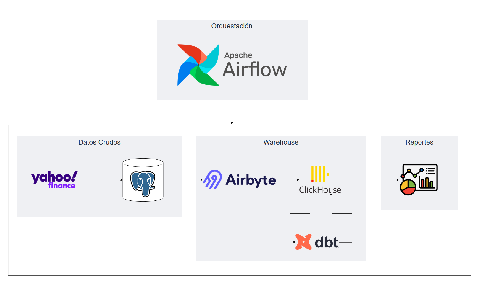
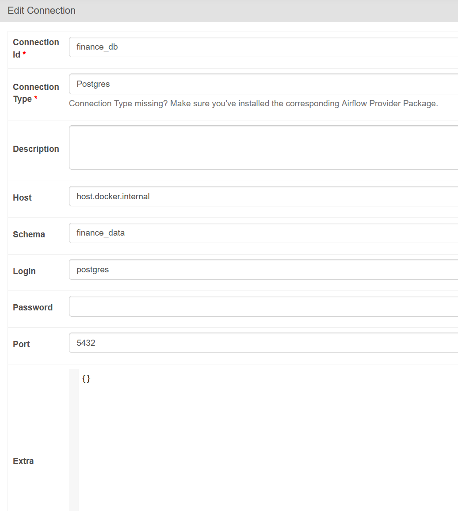
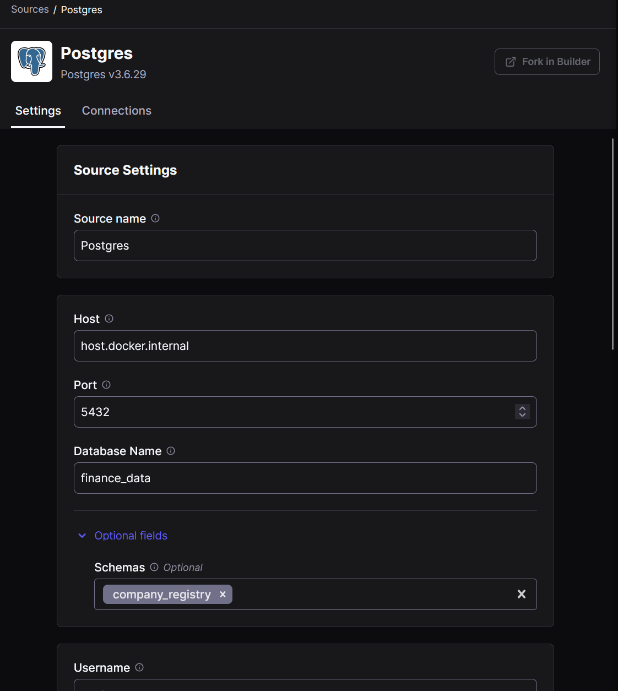
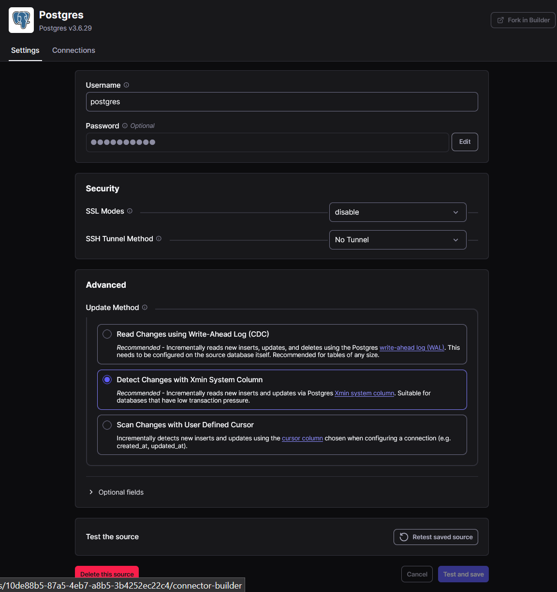
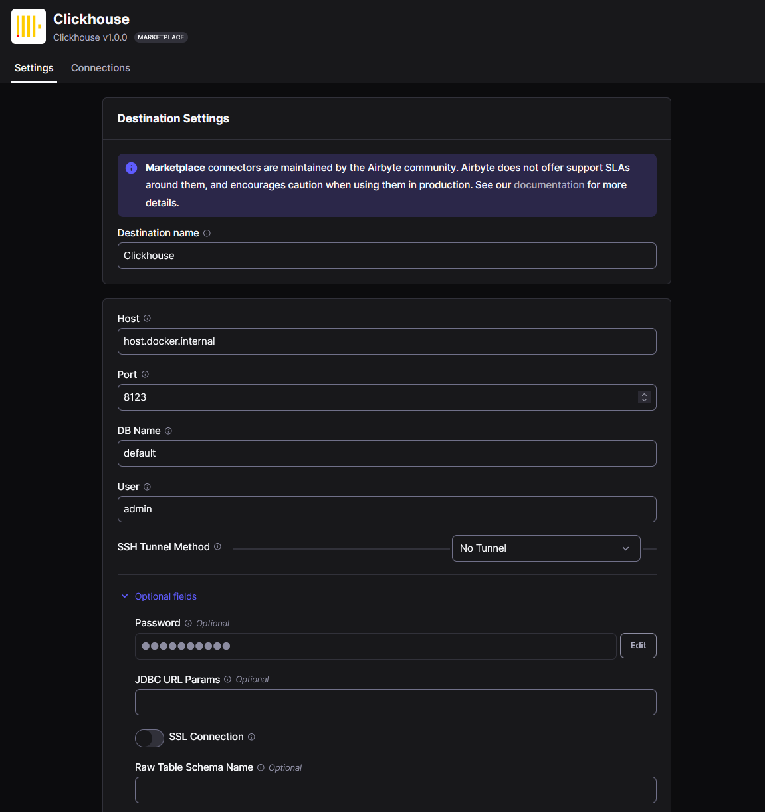

# Extractor de Datos de YFinance

## Arquitectura

Este es un pipeline que gestiona datos de acciones con YFinance a través de los siguientes pasos:
- Apache Airflow ejecuta una vez al día un script de Python que extrae los datos crudos
- La data cruda se carga en un "Landing Zone" (una BD de PostgreSQL)
- La data se mueve a una solución OLAP (Clickhouse) a través de Airbyte
- La data se procesa y transforma con DBT
- La data se visualiza a través de los dashboards de Clickhouse

## Setup

### Prerequisitos
- Sistema operativo Windows, macOS o Linux
- Docker Desktop y docker-compose

### Pasos para configurar el ambiente
1. Ejecutar el comando: `docker-compose up -d`. Esto levantara PostgreSQL, Clickhouse, DBT y Airflow
2. Configurar la conexión a la BD de PostgreSQL desde Airflow en Admin -> Connections con los siguientes datos:

3. Ejecutar el script ubicado en "resources/finance_data_schema.sql" para cargar la estructura de la BD
4. Desplegar el contenedor de airbyte a través de abctl: https://docs.airbyte.com/using-airbyte/getting-started/oss-quickstart
        Ejecutar:
            - abctl local install (esto levanta el contenedor)
            - abctl local credentials (esto retorna las credenciales para acceder)
5. Configurar PostgreSQL como fuente ingresando los siguientes datos (usar las credenciales del .env y la BD para los campos de database_name, username y password):

6. Configurar Clickhouse como fuente destino ingresando los siguientes datos (igualmente basarse en los valores del .env para los accesos)

7. Crear la conexión entre ambas fuentes, marcando que se ejecute cada 24 horas y que el "Destination namespace" sea "Destination-defined". PostgreSQL será la fuente y Clickhouse el destino.

Una vez configurado, el DAG de Airflow ha sido programado para cargar data cada 24 horas, buscando nueva información de la bolsa de valores.